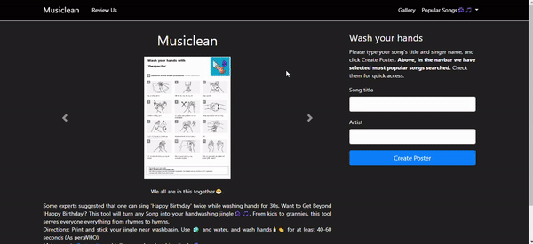

# <a href="https://musiclean.herokuapp.com/">musiclean</a>

Checkout the tool <a href="https://musiclean.herokuapp.com/">here</a>

We all are in this together😷.

Some experts suggested that one can sing 'Happy Birthday' twice while washing hands for 30s. 
Want to Get Beyond 'Happy Birthday'? This tool will turn any Song into your handwashing jingle🎶🎵. From kids to grannies, this tool serves everyone everything from rhymes to hymns.
 Directions: Print and stick your jingle near washbasin. Use 🧼 and water, and wash hands🧴👏  for at least 40-60 seconds (As per:WHO) 
 
Make sure to Review Us and tell us your handwashing jingle🎵.

## How I built it?
The web app is built on `Django`, a python framework. Apart from all the miscellaneous backend activities, there is a script written in python which uses `Pillow` library and `musicmatch` API. For unicodes decoding, it uses library called `raqm`. In short, user sends the query which request the Django App which further requests musixmatch API, the response, in the form of lyrics, is then send to Django App and finally it is edited on the template picture.This response in the form of '.png' file is sent to the user.

## How do I use this directory?
1. Create and activate virtual environment
`virtualenv <envname>`
2. Clone the repo
`git clone https://github.com/vidushi-agarwal/musiclean`
3. Install all the packages
`pip install -r requirements.txt`
4. Run the tool on localhost
`python manage.py runserver`

Till date there are over 1400 posters onboard
